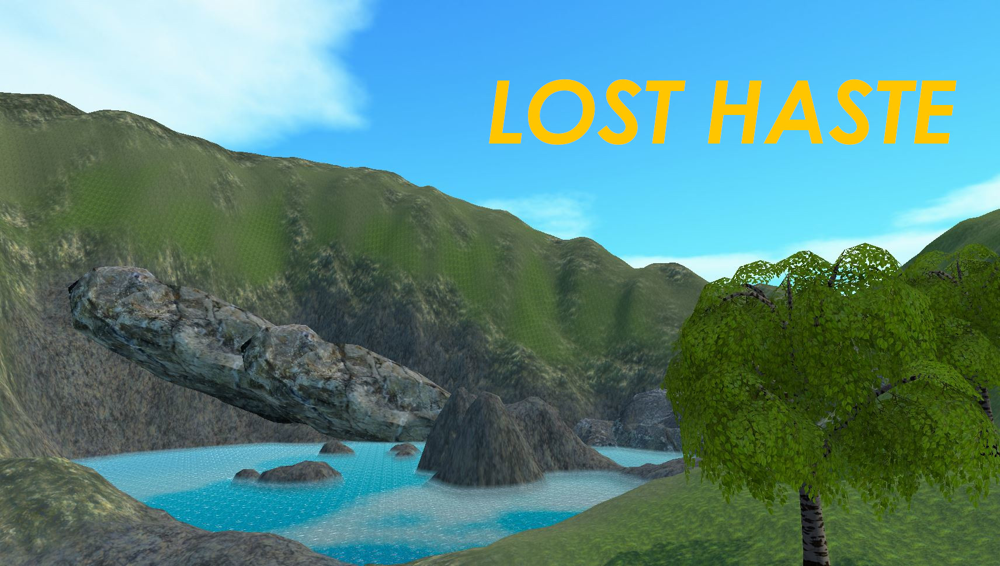

<!-- PROJECT -->
 

    

  <h1 align="center">Lost Haste</h3>

  

    3D Open World Survival Craft Game
     
    Explore the docs »
     
     
  

<!-- TABLE OF CONTENTS -->

  
Table of Contents

  <ol>
    <li>
      <a href="#about-the-project">About The Project</a>
      <ul>
        <li><a href="#built-with">Built With</a></li>
      </ul>
    </li>
    <li><a href="#usage">Usage</a></li>
    <li><a href="#license">License</a></li>
    <li><a href="#contact">Contact</a></li>
    <li><a href="#acknowledgments">Acknowledgments</a></li>
  </ol>

<!-- ABOUT THE PROJECT -->
## About The Project

Lost Haste is an immersive open-world survival craft game that challenges players to navigate and survive through the uncharted wilderness. Set in a richly detailed and wilderness packed landscape, the game offers a uniquely immersive and engaging experience. As players explore and collect resources, they must craft tools, build shelter, and defend themselves from dangerous predators while uncovering the secrets of this unknown environment. With stunning graphics, a fascinating storyline, and endless possibilities for exploration and creativity, Lost Haste is a must play for fans of survival and adventure games.

Lost Haste is an open world survival craft game that uses many similar mechanics from games like Minecraft, Rust, and The Forest together to create an immersive gaming experience. It features player vs. environment gameplay, where users must compete against the game’s artificial intelligence. Focus on surviving while monitoring your health, hunger, and thirst. Players must craft, gather, and build the necessary components needed to survive the elements of the outdoors. Players are faced with creatures that can be friendly or dangerous, the only way is to find out. Build, explore, and survive in this first-person fantasy survival game – Lost Haste.

After completion of Lost Haste, many game mechanics were added with over 35 scripts making it possible. Many features such as an inventory system with the ability to clear certain items, a crafting system broken up into various categories, a status bar system that tracks health, hunger, and thirst. Hunger being tracked based on distance traveled and thirst being tracked based on time in the game. A saving/loading system that can be switched between binary or encrypted Json. Game saving stores all information such as players last location, inventory system, and all game objects that were removed from the game. Animals that feature an AI script allowing them to move and stop at random intervals in random directions. The ability to chop trees having independent health/status bars and crafting structures via building menu similar to games like Rust.

(<a href="#readme-top">back to top</a>)

### Built With

This project was built entirely using the Unity Game Engine with the help of VSCode for the numerous C# scripts. I also had a number of assets that were used to make this project possible. Here are a few of which I had used from the Unity Asset Store.

* [Resources and Craft Icon Pack](https://assetstore.unity.com/packages/2d/gui/icons/resources-and-craft-icon-pack-40750)
* [Water Shaders V2.x](https://assetstore.unity.com/packages/vfx/shaders/water-shaders-v2-x-149916)
* [Midgard Textures](https://assetstore.unity.com/packages/2d/textures-materials/nature/midgard-textures-218478)
* [Survival Tools (Hand Painting)](https://assetstore.unity.com/packages/3d/props/weapons/survival-tools-hand-painting-88536)
* [Ultimate Stick & Branches Package / 30 Variations](https://assetstore.unity.com/packages/3d/props/ultimate-stick-branches-package-30-variations-241121)
* [Basic RPG Cursors](https://assetstore.unity.com/packages/2d/textures-materials/basic-rpg-cursors-139404)
* [Fantasy Wooden GUI : Free](https://assetstore.unity.com/packages/2d/gui/fantasy-wooden-gui-free-103811)
* [GUI Parts](https://assetstore.unity.com/packages/2d/gui/icons/gui-parts-159068)
* [Yughues Free Rocks](https://assetstore.unity.com/packages/3d/environments/yughues-free-rocks-13568)
* [White Rabbit](https://assetstore.unity.com/packages/3d/characters/animals/white-rabbit-138709)
* [Fantasy Skybox FREE](https://assetstore.unity.com/packages/2d/textures-materials/sky/fantasy-skybox-free-18353)
* [Fantasy landscape](https://assetstore.unity.com/packages/3d/environments/fantasy-landscape-103573)

(<a href="#readme-top">back to top</a>)

<!-- USAGE EXAMPLES -->
## Usage

Down below is my written final copy of the project report. This includes all time logged information as well as a better understanding of what the intentions of the project were as well as the goals.

_For more information, please refer to the [Documentation](https://drive.google.com/file/d/1Io12PpQHvacVqHc9IZMb1hTe6Tq8FE0b/view?usp=sharing)_

(<a href="#readme-top">back to top</a>)

<!-- LICENSE -->
## License

Distributed under the MIT License. See `LICENSE.txt` for more information.

(<a href="#readme-top">back to top</a>)

<!-- CONTACT -->
## Contact

James Rupa - [@jamesrupa](https://https://www.linkedin.com/in/jamesrupa/) - jamesjrupa@gmail.com

Project Link: [https://https://github.com/jamesrupa/Lost-Haste](https://https://github.com/jamesrupa/Lost-Haste)

(<a href="#readme-top">back to top</a>)

<!-- ACKNOWLEDGMENTS -->
## Acknowledgments

Use this space to list resources you find helpful and would like to give credit to. I've included a few of my favorites to kick things off!

* [Unity Manual](https://docs.unity3d.com/Manual/UnityManual.html)
* [Microsoft C#](https://learn.microsoft.com/en-us/dotnet/csharp/)
* [Unity C#](https://unity.com/how-to/learning-c-sharp-unity-beginners)
* [Open World Survival Craft](https://www.youtube.com/playlist?list=PLtLToKUhgzwnk4U2eQYridNnObc2gqWo-)

(<a href="#readme-top">back to top</a>)

